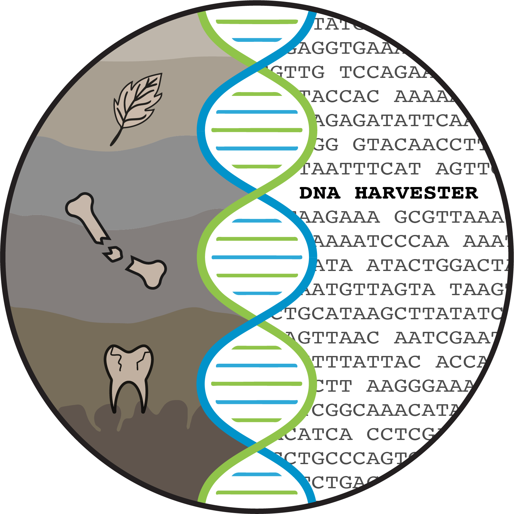
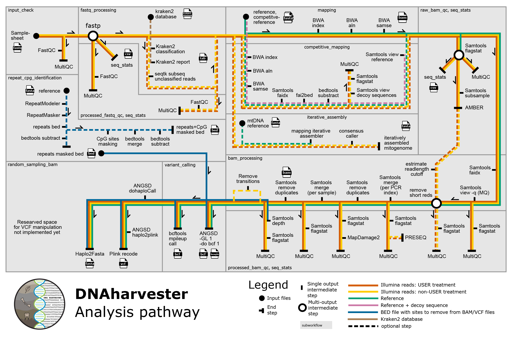

# DNAharvester

Github repository for DNAharvester, a pipeline for processing
and analyzing extremely degraded ancient DNA.

## Documentation

The documentation can be found in the Github [wiki](https://github.com/NBISweden/DNAharvester/wiki).

## Pipeline map

Main workflow of the Pipeline:

## Citation

If you've used DNAharvester pipeline to produce results, please cite our paper:

## Licence information

DNAharvester - a pipeline for processing and analyzing extremely degraded ancient DNA

Copyright (C) 2025  Muhammad Bilal Sharif, Verena Kutschera

This program is free software: you can redistribute it and/or modify
it under the terms of the GNU General Public License as published by
the Free Software Foundation, either version 3 of the License, or
(at your option) any later version.

This program is distributed in the hope that it will be useful,
but WITHOUT ANY WARRANTY; without even the implied warranty of
MERCHANTABILITY or FITNESS FOR A PARTICULAR PURPOSE.  See the
GNU General Public License for more details.

You should have received a copy of the GNU General Public License
along with this program. If not, see <https://www.gnu.org/licenses/>.